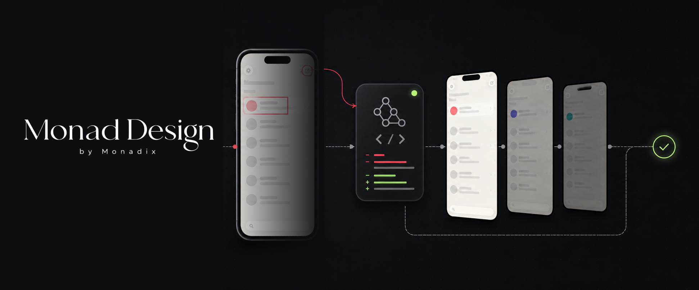
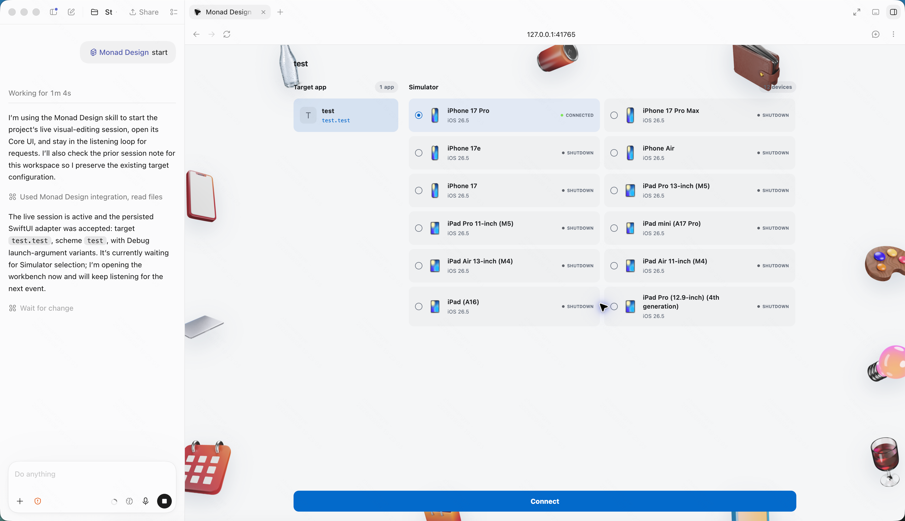
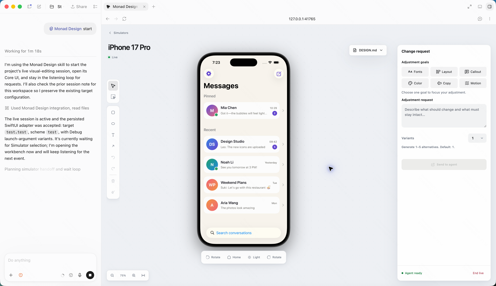
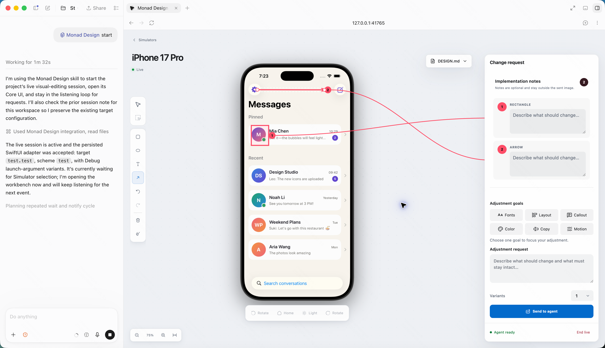
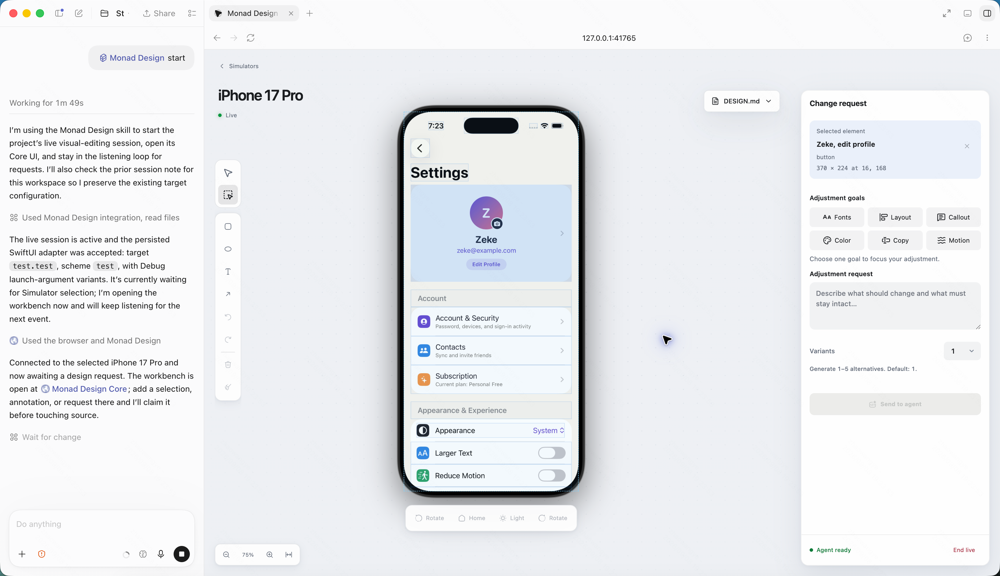
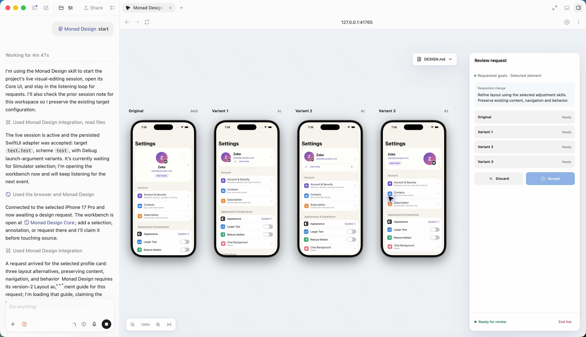

<p align="center">
  
</p>

# Monad Design

> **The app is the canvas.**

Monad Design is a visual implementation workspace for coding agents and running mobile native apps. Navigate to the exact state, point to what should change, compare real alternatives, and approve the result before it becomes the new design.

The current preview implements this workflow for local iOS development on macOS.

## Install

Install Monad Design Core and connect it to a supported coding agent:

```bash
npx monad-design install
```

Then open your existing Expo or Xcode iOS project in the agent and start a live session:

```text
/monad-design start
```

The npm package includes the CLI and machine-level Core runtime for Apple silicon and Intel Macs. It does not include the Desktop or iPad apps.

To run Monad Design from source, read [CONTRIBUTING.md](CONTRIBUTING.md) for setup instructions and development commands.

## Design in the running mobile app

Monad Design keeps design feedback connected to the real product instead of a detached mockup:

- **Show the exact state**: navigate the app yourself, including screens that depend on account data, navigation, or interaction
- **Point instead of overexplaining**: select an element or draw directly on the screen
- **Compare before deciding**: review the original and several alternatives in the same app state
- **Stay in control**: accept a result, keep the original, or continue refining the request

Your coding agent continues working in the existing repository. Monad Design gives both of you a shared visual workspace for requests, previews, and decisions.

## Complete a change with your coding agent

Each live session follows one repeatable loop. You control the app and approve the design; your coding agent handles the source changes.

### 1. Start a live session

Open your mobile app project in a supported coding agent, then start Monad Design. The current preview detects Expo and Xcode iOS targets:

```text
/monad-design start
```

Choose the target app and Simulator you want to use.



### 2. Reproduce the right app state

Use **Interact** mode to control the app as you normally would. Navigate to the screen you want to improve and prepare any state the agent should preserve.



### 3. Describe the change visually

Use **Annotate** mode when the change involves an area, position, or relationship. Draw rectangles, ellipses, text, and arrows on the screen, then add notes to explain the intended result.



Use **Select** mode when you want to change a specific element. Select it, describe the outcome, and request one to five alternatives.



### 4. Let the agent implement the request

Your coding agent reads the visual context, finds the relevant source, and updates the existing app. You can continue the conversation with the agent while it works.

### 5. Compare and choose

Review the original and every alternative side by side in the same screen state. Accept the option you prefer or keep the original. The agent applies your decision and confirms when the app is ready.



After one change finishes, the same session stays available for the next request. You can repeat the loop until the screen feels right.

## What you can do today

The current preview lets you:

- Control a local iOS Simulator from the visual workspace
- Select interface elements and send their visual context to your coding agent
- Annotate the running screen with shapes, arrows, text, and implementation notes
- Request and compare one to five alternatives
- Keep refining the app in the same live session
- Use the iPad companion for touch control and Apple Pencil annotation
- Work with local agents including Codex, Claude Code, Cursor, Gemini CLI, GitHub Copilot, OpenCode, Windsurf, and Zed

## What you need

To use the complete workflow, you need:

- A Mac with Xcode and an installed iOS Simulator
- An existing Git repository containing an Expo or Xcode iOS app
- A supported local coding agent
- Image input support in the agent when you send annotated requests

## Keep your project under your control

Monad Design works with projects and Simulators that you explicitly choose. Your coding agent edits the same repository you already use, so you can inspect every source change with your existing Git workflow.

Project configuration and captured evidence stay local and are excluded from Git by default. Pair only trusted devices on trusted networks, review agent-made changes, and never commit credentials or private captured evidence.

## Current scope

Monad Design is built for mobile native apps. The current preview implements the workflow for local iOS development on macOS.

The preview supports one active change at a time and expects a local coding agent to perform the implementation.

The repository does not include a sample target app or hosted coding-agent service. Physical-device and external-agent behavior may vary by setup.

## Roadmap

The roadmap focuses on:

- Simpler onboarding and broader coding-agent support
- Desktop and iPad app distribution
- Android support

## Contribute

Read [CONTRIBUTING.md](CONTRIBUTING.md) before making a change and follow the [Code of Conduct](CODE_OF_CONDUCT.md). Open an issue before a large change to confirm scope and avoid duplicated work.

## License

Monad Design is licensed under the [Apache License 2.0](LICENSE).
